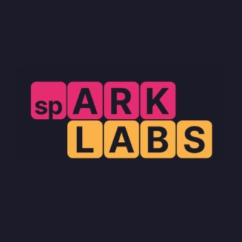

# sp-ARK Plugins

AI agent plugins for [Claude Code](https://claude.ai/code), built for the sp-ARK startup accelerator. Each plugin adds slash-command skills that automate operations workflows — no code required to use them.

## Plugins

### Marketing (`sp-ark-marketing`)
Automates event marketing outreach. Scrapes the CEO's inbox to build a contact database and drafts personalized event invitations.

| Skill | Usage |
|---|---|
| `/scrape-inbox` | Scan Gmail for new contacts and append them to the distribution list |
| `/draft-invites` | Draft personalized Gmail invites for a given event to all uninvited contacts |

Requires Gmail and Google Drive connected via claude.ai integrations.

---

### Community Management (`sp-ark-community`)
Automates expense reporting. Reads PDF receipts from a local folder, categorizes each transaction, and writes the results to a local Excel report.

| Skill | Usage |
|---|---|
| `/expense-report` | Process a folder of PDF receipts and append transactions to the Excel expense report |

Works entirely with local files — no external connectors required.

---

## Install

Add this repo as a marketplace in Claude Code, then install the plugin you need:

```
/plugin marketplace add JarredR092699/sp-ARK-plugins
/plugin install sp-ark-community@sp-ark-plugins
/plugin install sp-ark-marketing@sp-ark-plugins
```

## About

Built by [sp-ARK Labs](https://sparklabs.com) — a startup accelerator helping early-stage founders build, launch, and grow.
